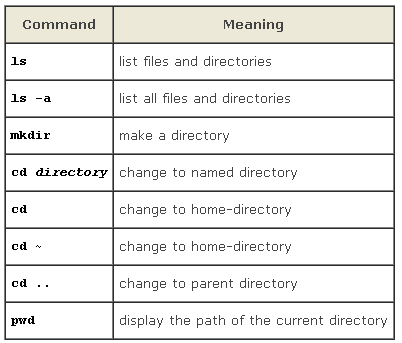

# Geocomputation Workshop

This workshop will introduce attendees to performing Geocomputation analysis using a High-Performance Computing (HPC) cluster. Methods for parallel computing will be presented in the context of geospatial analysis. Participants will be introduced to geospatial tools available on the midway cluster. Most of the hands-on training could be done on any operating system; however, some parts of the hands-on will be demonstrated using the Midway2 cluster.

(i) introduction to single-threaded and multithreaded geospatial tools such as GDAL/OGR, arcpy, and simple features (SF), raster, and stars packages in R.

(ii) implicit and explicit parallelization

(iii) introduction to Slurm

(iv) writing simple Bash scripts for raster and vector processing

**Prerequisites:** Basic knowledge of Geographic Information Systems and previous experience of working with the command line is assumed.

---

All the exercise could be replicated on midway cluster. Anyway, if you don't have access to it, follow the exercise, try to understand the concept, and then you can replicate in your computer.

## Introduction to single-threaded and multithreaded geospatial tools such as GDAL/OGR, arcpy, and simple features (SF), raster, and stars packages in R

Geo-computation is the computation and manipulation of geographic data to answer different kinds of research questions. This data is becoming bigger and bigger, larger and larger, as you saw in the last ten years. So you really need powerful tools to be able to compute large processing analysis. You also need a huge computer-- so a supercomputer that we are using at UChicago. So the combination of powerful tools and powerful computers allows you to perform extensive analysis. Nonetheless, these tools, especially with GDAL, R, and python, can be used also on your laptop.

**Linux shell:** If you want to learn about the shell you should go to the [software carpentry website](https://swcarpentry.github.io/shell-novice/). What you will find here are the commands that are essential for working with GDAL.

*Shell prompt in native Linux*

`$`



### Spatial Data Formats:

Geospatial data comes in two primary types: [raster data](https://en.wikipedia.org/wiki/Raster_data) and [vector data](https://en.wikipedia.org/wiki/Vector_graphics).

You can read in greater detail about different geospatial data formats [on wikipedia](https://en.wikipedia.org/wiki/GIS_file_formats), but the basic data structures are:

- Raster data is data that is distributed on a grid.
    - A raster is just a grid of data, where each cell in the grid has some value (or values).
    - The cells are sometimes also called pixels. With image data, each pixel in the raster might have several values, such as the value of red, green and blue hues.
    - Image data thus has **bands**: each band is the information pertaining to the different colors.
- Vector data is data that is a collection of points or polygons distributed in space.
    - "Vector" in the geospatial context doesn’t mean the same thing as in a mathematial context: vector geospatial data includes any data that has vertices that can be anywhere in space.
    - This contrasts with raster data where the data points are fixed in space, usually on a rectangular grid.

These different kinds of data have different file formats. There is are two linked software libraries for processing these data, called [GDAL](http://www.gdal.org/) and [OGR](http://gdal.org/1.11/ogr/): they are commonly used in geospatial software so you should be able to convert between the data types that are read by these two packages. Click on the links for information:

- [Common raster file formats](http://www.gdal.org/formats_list.html).
- [Common vector file formats](http://www.gdal.org/ogr_formats.html).

[The Ultimate List of GIS Formats and Geospatial File Extensions](https://gisgeography.com/gis-formats/)

### GDAL

GDAL (the Geospatial Data Abstraction Library) is a popular software package for manipulating geospatial data. GDAL allows for manipulation of geospatial data in the Linux operating system, and for most operations is much faster than GUI-based GIS systems (e.g., ArcMap).

In the GDAL docs it recommends to use Conda to install GDAL however one of the alternatives that is not listed is [GIS Internals](https://www.gisinternals.com/) which provide a number of options including MSI installers for Windows for both the stable and development release.

For this workshop we will use stable version and this can be download using the instructions at GDAL site [https://gdal.org/download.html](https://gdal.org/download.html).

*<u>How do I get GDAL on my computer</u>*

###### Installation in Windows: 

1. Using network installer at OSGeo4W or  
2. using conda install -c  conda-forge gdal

###### Installation in Mac 

http://www.kyngchaos.com/software/frameworks/    echo 'export PATH=/Library/Frameworks/GDAL.framework/Programs:$PATH' >> ~/.bash_profile source ~/.bash_profile

###### Installation in Ubuntu: 

sudo apt-get install gdal-bin

### Basic Examples

One of the most frequent operations in GDAL is just to see what sort of data you have. The tool for doing this is gdalinfo which is run with the command line:

```bash
$ gdalinfo filename
```

where filename is the name of your raster. This is used mostly to:

See what projection your raster is in, and to check the extent of the raster.

```bash
$ gdalinfo col_viirs_100m_2016.tif
```

The output gives us a lot of information about this file including its coordinate system (if it has one), the pixel size, origin, metadata, the compression used on the file and the color ramp.

**OGRINFO:** open a new command prompt window in Data/Vector/Shapefile

```bash
ogrinfo gadm36_COL_1.shp
ogrinfo -so gadm36_COL_1.shp
ogrinfo -so gadm36_COL_1.shp gadm36_COL_1
```

### Geocomputation in R

In general, R requires dataset to be loaded into memory. A notable feature of the raster package is that it can work with raster datasets that are stored on disk and are too large to be loaded into memory(RAM). The package is built around a number of 'S4' classes of which the RasterLayer, RasterBrick, and RasterStack classes are the most important.

A RasterLayer object represents single-layer (variable) raster data. A RasterLayer object always stores a number of fundamental parameters that describe it. These include the number of columns and rows, the coordinates of its spatial extent ('bounding box'), and the coordinate reference system (the 'map projection').
In addition, a RasterLayer can store information about the file in which the raster cell values are stored (if there is such a file). A RasterLayer can also hold the raster cell values in memory.

The raster package has two classes for multi-layer data the RasterStack and the RasterBrick

**Open raster_basics_in_R.Rmd**


## Introduction to Midway

• The RCC Midway compute systems

• Using Slurm (Simple Linux Utility for Resource Management) to submit jobs to the RCC Midway systems

Midway is a constellation a of many compute systems and storage with various architectures coupled together in one system.

Slurm is the software used to manage the workload on Midway.


Basic Definitions:

• A **processor** is a small chip that responds to and processes the basic instructions that drive a computer. The term *processor* is used interchangeably with the term **central processing unit** (CPU)

• **Core**: The smallest compute unit that can run a program

• **Socket:** A compute unit, packaged as one and usually made of a single chip often called processor. Modern sockets carry many cores (10, 14, or 20, 24, 28, etc. on most servers)

• **Node:** A stand-alone computer system that contains one or more sockets, memory, storage, etc. connected to other nodes via a fast network interconnect.


Schematic of the Midway Cluster

Other Workshops Slides 
<a href="https://docs.google.com/presentation/d/1IxJ2VxfhVmru2YP-VPh4JzYNV7Vp4m39AEC-6t6ETJQ/edit" target="_blank"> Intro to RCC Workshop Slides Fall 2021</a>

**Brief**

There are about more than 1300+ nodes compute nodes on midway2, but only 2 login nodes. Midway3 have 217 standard compute Intel Cascade Lake Compute nodes.

Midway3 has Intel Xeon Gold 6248R, 24Core x 2 per node, 3.0GHz Processor
2 Large shared memory Intel Cascade Lake Compute nodes
(up to 1.5 TB memory per node) 

Running intensive programs on the login nodes causes the login nodes to be slow for all other users.

● login nodes are for editing files, compiling, moving files, changing permissions, and other non-intensive tasks.

● We recommend to use *sinteractive* for interactive runs

● For long running jobs => submit them to the queue

**Running Interactive jobs**

• login directly to a node

–Login to midway2.rcc.uchicago.edu

–Run the job at the command prompt

• Run interactively using sinteractive

– Uses Slurm to provide access to dedicated node(s) to which you can login directly

To use sinteractive:

```bash
sinteractive --time=01:00:00 --nodes=1
	--ntasks=2 --mem-per-cpu=2000 
	–-partition=broadwl
```

A **job** is the resources you are using and the code you are running

The **queue** in Slurm is all RUNNING and all PENDING jobs To see every job in the queue on Midway, use the command

```bash
squeue
```

to see jobs in the queue

```bash
squeue –u <cnetid>
or
myq
```

A batch script is list of instructions for slurm.

```bash
#!/bin/bash

# Here is a comment
#SBATCH --time=1:00:00

#SBATCH –nodes=1
#SBATCH –ntasks-per-node=1
#SBATCH --mem-per-cpu=2000
#SBATCH –job-name=MyJob
#SBATCH –output= MyJob-%j.out
#SBATCH –error=MyJob-%j.err

module load <module name>
#Run your code
```

This #! is a shebang. It tells operating system to use /bin/bash with this script. symbol # is a comment.  Everything after # is ignored by bash

**Running batch jobs**
using a Submission Script

A simple job submission script (saved as python.sbatch):

```bash
#!/bin/bash

#SBATCH --job-name=first_python_job
#SBATCH --output=first_python_job_%j.out
#SBATCH --error=first_python_job_%j.err
#SBATCH --nodes=1
#SBATCH --ntasks-per-node=1
#SBATCH --mem-per-cpu=2000M
#SBATCH --partition=broadwl
#SBATCH --time=00:30:00

module load python
python hello_world.py
echo “job finished at `date`”
```

To submit the above script:

```bash
sbatch python.sbatch
```

## Parallelization

> **Explicit parallelism** -- programmer must explicitly state which instructions can be executed in parallel, e.g. MPI

> **Implicit parallelism** -- automatic detection by compiler of instructions that can be performed in parallel. e.g. OpenMP

**OpenMP Job**

```bash
#!/bin/bash

#Here is a comment
#SBATCH --time=1:00:00
#SBATCH –partition=broadwl
#SBATCH –nodes=1
**#SBATCH –ntasks-per-node=8**
#SBATCH --mem-per-cpu=2000
#SBATCH –job-name=MyJob
#SBATCH –output= MyJob-%j.out
#SBATCH –error=MyJob-%j.err

module load <module name>
export OMP_NUM_THREADS=8 
#Run your code
./my_executable
```

OMP_NUM_THREADS is an environment variable.

**Parallel MPI job**

```bash
#!/bin/bash
#Here is a comment
#SBATCH --time=1:00:00
#SBATCH –job-name=MyJob
#SBATCH –output= MyJob-%j.out
#SBATCH –error=MyJob-%j.err
#SBATCH –partition=broadwl
#SBATCH –nodes=4
#SBATCH –ntasks-per-node=8
#SBATCH --mem-per-cpu=2000
module load openmpi
module load <module name>
#Run your code
mpirun  ./my_executable
```

<a href="https://github.com/rcc-uchicago/GeoComputation/blob/master/slurm_commands.md" target="_blank">**slurm commands**</a>


## QGIS 

### Calling algorithms from the Python console and Bash
```python
from qgis import processing
```
To find the right name for your algorithm, use the processingRegistry. Type the following line in console:
```python
for alg in QgsApplication.processingRegistry().algorithms():
        print(alg.id(), "->", alg.displayName())
```
Or inside Linux type the following line:
```bash
qgis_process list
```
You will get the following output

```python
QGIS (native c++)
	native:addautoincrementalfield	Add autoincremental field
	native:addfieldtoattributestable	Add field to attributes table
	native:adduniquevalueindexfield	Add unique value index field
	native:addxyfields	Add X/Y fields to layer
	native:affinetransform	Affine transform
	native:aggregate	Aggregate
	native:angletonearest	Align points to features
	native:antimeridiansplit	Geodesic line split at antimeridian
	native:arrayoffsetlines	Array of offset (parallel) lines
	native:arraytranslatedfeatures	Array of translated features
	native:aspect	Aspect
	native:assignprojection	Assign projection
	native:atlaslayouttoimage	Export atlas layout as image
	native:atlaslayouttopdf	Export atlas layout as PDF
	native:bookmarkstolayer	Convert spatial bookmarks to layer
	native:boundary	Boundary
	native:boundingboxes	Bounding boxes
	native:buffer	Buffer
	native:bufferbym	Variable width buffer (by M value)
	native:calculatevectoroverlaps	Overlap analysis
	native:cellstatistics	Cell statistics
	native:centroids	Centroids
	native:clip	Clip
	native:collect	Collect geometries
	native:combinestyles	Combine style databases
	native:converttocurves	Convert to curved geometries
	native:convexhull	Convex hull
	native:countpointsinpolygon	Count points in polygon
	native:createattributeindex	Create attribute index
	native:createconstantrasterlayer	Create constant raster layer
	native:creategrid	Create grid
	native:createpointslayerfromtable	Create points layer from table
	native:createrandombinomialrasterlayer	Create random raster layer (binomial distribution)
	native:createrandomexponentialrasterlayer	Create random raster layer (exponential distribution)
	native:createrandomgammarasterlayer	Create random raster layer (gamma distribution)
	native:createrandomgeometricrasterlayer	Create random raster layer (geometric distribution)
	native:createrandomnegativebinomialrasterlayer	Create random raster layer (negative binomial distribution)
	native:createrandomnormalrasterlayer	Create random raster layer (normal distribution)
	native:createrandompoissonrasterlayer	Create random raster layer (poisson distribution)
	native:createrandomuniformrasterlayer	Create random raster layer (uniform distribution)
	native:createspatialindex	Create spatial index
	native:dbscanclustering	DBSCAN clustering
	native:deleteduplicategeometries	Delete duplicate geometries
	native:deleteholes	Delete holes
	native:densifygeometries	Densify by count
	native:densifygeometriesgivenaninterval	Densify by interval
	native:detectvectorchanges	Detect dataset changes
	native:difference	Difference
	native:dissolve	Dissolve
	native:dropgeometries	Drop geometries
	native:dropmzvalues	Drop M/Z values
	native:equaltofrequency	Equal to frequency
	native:explodehstorefield	Explode HStore Field
	native:explodelines	Explode lines
	native:extendlines	Extend lines
	native:extenttolayer	Create layer from extent
	native:extractbinary	Extract binary field
	native:extractbyattribute	Extract by attribute
	native:extractbyexpression	Extract by expression
	native:extractbyextent	Extract/clip by extent
	native:extractbylocation	Extract by location
	native:extractmvalues	Extract M values
	native:extractspecificvertices	Extract specific vertices
	native:extractvertices	Extract vertices
	native:extractzvalues	Extract Z values
	native:fieldcalculator	Field calculator
	native:filedownloader	Download file
	native:fillnodata	Fill NoData cells
	native:filterverticesbym	Filter vertices by M value
	native:filterverticesbyz	Filter vertices by Z value
	native:fixgeometries	Fix geometries
	native:flattenrelationships	Flatten relationship
	native:forcerhr	Force right-hand-rule
	native:fuzzifyrastergaussianmembership	Fuzzify raster (gaussian membership)
	native:fuzzifyrasterlargemembership	Fuzzify raster (large membership)
	native:fuzzifyrasterlinearmembership	Fuzzify raster (linear membership)
	native:fuzzifyrasternearmembership	Fuzzify raster (near membership)
	native:fuzzifyrasterpowermembership	Fuzzify raster (power membership)
	native:fuzzifyrastersmallmembership	Fuzzify raster (small membership)
	native:generatepointspixelcentroidsinsidepolygons	Generate points (pixel centroids) inside polygons
	native:geometrybyexpression	Geometry by expression
	native:greaterthanfrequency	Greater than frequency
	native:highestpositioninrasterstack	Highest position in raster stack
	native:hillshade	Hillshade
	native:hublines	Join by lines (hub lines)
	native:importphotos	Import geotagged photos
	native:interpolatepoint	Interpolate point on line
	native:intersection	Intersection
	native:joinattributesbylocation	Join attributes by location
	native:joinattributestable	Join attributes by field value
	native:joinbynearest	Join attributes by nearest
	native:kmeansclustering	K-means clustering
	native:layertobookmarks	Convert layer to spatial bookmarks
	native:lessthanfrequency	Less than frequency
	native:linedensity	Line density
	native:lineintersections	Line intersections
	native:linesubstring	Line substring
	native:lowestpositioninrasterstack	Lowest position in raster stack
	native:meancoordinates	Mean coordinate(s)
	native:mergelines	Merge lines
	native:mergevectorlayers	Merge vector layers
	native:minimumenclosingcircle	Minimum enclosing circles
	native:multiparttosingleparts	Multipart to singleparts
	native:multiringconstantbuffer	Multi-ring buffer (constant distance)
	native:nearestneighbouranalysis	Nearest neighbour analysis
	native:offsetline	Offset lines
	native:orderbyexpression	Order by expression
	native:orientedminimumboundingbox	Oriented minimum bounding box
	native:orthogonalize	Orthogonalize
	native:package	Package layers
	native:pixelstopoints	Raster pixels to points
	native:pixelstopolygons	Raster pixels to polygons
	native:pointonsurface	Point on surface
	native:pointsalonglines	Points along geometry
	native:pointtolayer	Create layer from point
	native:poleofinaccessibility	Pole of inaccessibility
	native:polygonfromlayerextent	Extract layer extent
	native:polygonize	Polygonize
	native:polygonstolines	Polygons to lines
	native:postgisexecutesql	PostgreSQL execute SQL
	native:printlayoutmapextenttolayer	Print layout map extent to layer
	native:printlayouttoimage	Export print layout as image
	native:printlayouttopdf	Export print layout as PDF
	native:projectpointcartesian	Project points (Cartesian)
	native:promotetomulti	Promote to multipart
	native:randomextract	Random extract
	native:randompointsinextent	Random points in extent
	native:randompointsinpolygons	Random points in polygons
	native:randompointsonlines	Random points on lines
	native:rasterbooleanand	Raster boolean AND
	native:rasterize	Convert map to raster
	native:rasterlayerstatistics	Raster layer statistics
	native:rasterlayeruniquevaluesreport	Raster layer unique values report
	native:rasterlayerzonalstats	Raster layer zonal statistics
	native:rasterlogicalor	Raster boolean OR
	native:rastersampling	Sample raster values
	native:rastersurfacevolume	Raster surface volume
	native:reclassifybylayer	Reclassify by layer
	native:reclassifybytable	Reclassify by table
	native:rectanglesovalsdiamonds	Rectangles, ovals, diamonds
	native:refactorfields	Refactor fields
	native:removeduplicatesbyattribute	Delete duplicates by attribute
	native:removeduplicatevertices	Remove duplicate vertices
	native:removenullgeometries	Remove null geometries
	native:renametablefield	Rename field
	native:repairshapefile	Repair Shapefile
	native:reprojectlayer	Reproject layer
	native:rescaleraster	Rescale raster
	native:reverselinedirection	Reverse line direction
	native:rotatefeatures	Rotate
	native:roundrastervalues	Round raster
	native:ruggednessindex	Ruggedness index
	native:savefeatures	Save vector features to file
	native:saveselectedfeatures	Extract selected features
	native:segmentizebymaxangle	Segmentize by maximum angle
	native:segmentizebymaxdistance	Segmentize by maximum distance
	native:serviceareafromlayer	Service area (from layer)
	native:serviceareafrompoint	Service area (from point)
	native:setlayerencoding	Set layer encoding
	native:setlayerstyle	Set layer style
	native:setmfromraster	Set M value from raster
	native:setmvalue	Set M value
	native:setzfromraster	Drape (set Z value from raster)
	native:setzvalue	Set Z value
	native:shortestpathlayertopoint	Shortest path (layer to point)
	native:shortestpathpointtolayer	Shortest path (point to layer)
	native:shortestpathpointtopoint	Shortest path (point to point)
	native:shpencodinginfo	Extract Shapefile encoding
	native:simplifygeometries	Simplify
	native:singlesidedbuffer	Single sided buffer
	native:slope	Slope
	native:smoothgeometry	Smooth
	native:snapgeometries	Snap geometries to layer
	native:snappointstogrid	Snap points to grid
	native:spatialiteexecutesql	SpatiaLite execute SQL
	native:spatialiteexecutesqlregistered	SpatiaLite execute SQL (registered DB)
	native:splitfeaturesbycharacter	Split features by character
	native:splitlinesbylength	Split lines by maximum length
	native:splitvectorlayer	Split vector layer
	native:splitwithlines	Split with lines
	native:stylefromproject	Create style database from project
	native:subdivide	Subdivide
	native:sumlinelengths	Sum line lengths
	native:swapxy	Swap X and Y coordinates
	native:symmetricaldifference	Symmetrical difference
	native:taperedbuffer	Tapered buffers
	native:tinmeshcreation	TIN Mesh Creation
	native:transect	Transect
	native:translategeometry	Translate
	native:truncatetable	Truncate table
	native:union	Union
	native:wedgebuffers	Create wedge buffers
	native:writevectortiles_mbtiles	Write Vector Tiles (MBTiles)
	native:writevectortiles_xyz	Write Vector Tiles (XYZ)
	native:zonalhistogram	Zonal histogram
	native:zonalstatisticsfb	Zonal statistics
```


## Writing simple Bash scripts for raster and vector processing


Using arcpy on Midway and MidwayR
```bash
export ARCGISHOME=$HOME/arcgis/server

# If you need only Python and arcpy you don't need to start the server.
# Note that you have to use ArcGIS' own Python installation instead of the
# default system installation. Python on ArcGIS Server for Linux runs
# a Windows version of Python under Wine.

# You start the ArcGIS Python console with:
/home/<user>/arcgis/server/tools/python

#If it does not work, Use Anaconda3 2019.03 module 
module load Anaconda3/2019.03
source activate arcpy

```
or launch directly 
```bash
cd /home/pnsinha/arcgis/server/tools
./python /project2/rcc/examplecode.py
```


Open Python and test if 'import arcpy' works.

**Geocoding Example**

```bash
import arcpy
from arcpy import env
env.workspace = "home/pnsinha/Documents/Geocoding/atlanta.gdb
arcpy.CreateAddressLocator_geocoding("US Address - Dual Ranges", "streets Primary", "'Feature ID' FeatureID VISIBLE NONE;'*From Left' L_F_ADD VISIBLE NONE;'*To Left' L_T_ADD VISIBLE NONE;'*From Right' R_F_ADD VISIBLE NONE;'*To Right' R_T_ADD VISIBLE NONE;'Prefix Direction' PREFIX VISIBLE NONE;'Prefix Type' PRE_TYPE VISIBLE NONE;'*Street Name' NAME VISIBLE NONE;'Suffix Type' TYPE VISIBLE NONE;'Suffix Direction' SUFFIX VISIBLE NONE;'Left City or Place' CITYL VISIBLE NONE;'Right City or Place' CITYR VISIBLE NONE;'Left Zipcode' ZIPL VISIBLE NONE;'Right Zipcode' ZIPR VISIBLE NONE;'Left State' State_Abbr VISIBLE NONE;'Right State' State_Abbr VISIBLE NONE", Atlanta_AddressLocator, "", "DISABLED")

address_table = "customer"
address_locator =  "Atlanta_AddressLocator"
address_fields = "street Address; City City; State State; ZIP zip"
geocode_result = "geocode_result"
arcpy.GeocodeAddresses(address_table, address_locator, address_fields, geocode_result, 'STATIC')
```
**GDAL script example**: Merge DEMs, create contour lines, perform hill-shade analysis, calculate slope, and use the raster calculator to select higher slop areas.


```bash
#Merge two rasters
gdal_merge –o mymerge.tif t27elu.dem t28elu.dem –ps 20 20

#Create contour lines
gdal_contour mymerge.tif mycontours.shp –i 20

#Hillshade
gdaldem hillshade mymerge.tif hillshade_30.tif –alt 45

#Slope
gdaldem slope mymerge.tif slope.tif

#raster calculator
gdal_calc --calc=“A*(A>80)” -A slope.tif --outfile=slopebin.tif
```
------

#### More Information on Opensource GIS

**[OSGeo-Live](http://live.osgeo.org/en/index.html) is a self-contained bootable DVD, USB thumb drive or Virtual Machine based on Lubuntu. We encourage using this Virtual Machine.**

#### **More Information on HPC Topics**

**XSEDE HPC Workshop Series**: [https://www.psc.edu/training-education/hpc-workshop-series](https://www.psc.edu/training-education/hpc-workshop-series)